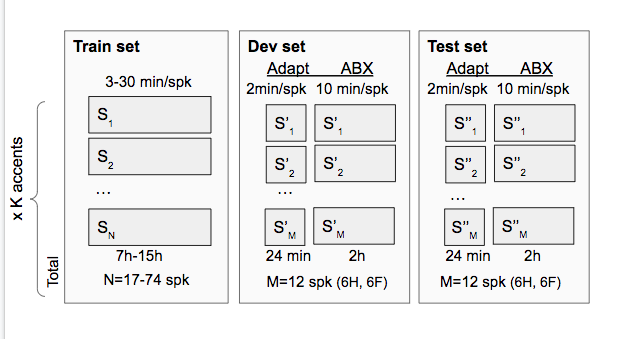

Getting Started with ABX-accent
===============================
To begin working with the ABX-accent project, follow these two main steps:

1. **Prepare the AESRC development dataset**
Process and format the data to be compatible with the ABX evaluation.

2. **Set up the evaluation environment**
Install and configure the software required to run ABX evaluations using ABXpy.
 
Project Structure
=================
The repository is organized into two main modules: 'scripts/ and data/, each containing several submodules related to data preparation and evaluation.
```
abx-accent/
├──  scripts
│   └── prepare/
│   │   └── abkhazia
│   │   └── data_splits/
│   │   │   └── aesrc_gender_split.py
│   │   │   └── aesrc_dataset_split.py
│   │   │   └── aesrc_speakers_list.txt
│   └── evals/
│   │   └── generate_item_files/
│   │   │   └── aesrc_item.py
│   │   └── generate_abx_score/
│   │   │   └── ABXpy/ABXpy
│   │   │   └── across_task.sh
│   │   │   └── within_task.sh
│   │   │   └── abx_score.sh
│   │   │   └── abx_distance.sh
│   │   │   └── abx_analyze.sh
│   │   │   └── h5features/
│   │   │   │   └── generate_features_files.py
│   │   └── README.rst
│   │   └── average_abx_score/
│   │   │   │   └── average_abx_score.py
│   └── README.rst
├── data/
│   └── prepare/
│   │   └── data_splits/
│   │   │   └── abx_files.csv
│   │   │   └── adapt_files.csv
│   │   └── abkhazia/
│   │   │   └── forced_alignment
│   └── evals/
│   │   └── item_files/
│   │   │   └── dev_set
│   │   │   └── test_set
│   │   └── abx_score/
│   │   │   └── across_task
│   │   │   └── within_task
│   │   └── abx_score_average/
│   │   │   └── dev_set
│   │   │   └── test_set
│   └── README.rst
│README.rst
```

**[Scripts](https://github.com/bootphon/ABX-accent/tree/main/abx-accent/scripts)**
This directory contains all the scripts used for preparing the dataset and running ABX evaluations.

- [Preparation Scripts](https://github.com/bootphon/ABX-accent/tree/main/abx-accent/scripts/prepare)
These scripts are responsible for processing the AESRC dataset into a format compatible with ABXpy.
 
  - [``Data splits``](https://github.com/bootphon/ABX-accent/tree/main/abx-accent/scripts/prepare/splits)
     The AESRC dataset is split into  *train*, *dev*, and *test* sets. The main steps include:

- **Set Splits**: Speakers are split across *train*, *dev*, and *test* sets, ensuring that each set contains different speakers for each of the ten accents.

- **Speaker and Gender Balance**: Both *test* and *dev* sets are balanced to include 6 male and 6 female speakers.

- **Speech Duration**: Each speaker contributes 10 minutes of speech in *test* and *dev* (totalling ~2 hours per set for ABX evaluation). Each also includes a 2-minute adaptation subset. The remaining data is used for training.


     
     
  - [``Abkhazia's scripts``](https://github.com/bootphon/ABX-accent/tree/main/abx-accent/scripts/prepare/abkhazia)
    This tools convert the dataset into the standard format required for ABXpy.
  
- [``Evaluations scripts``](https://github.com/bootphon/ABX-accent/tree/main/abx-accent/scripts/evals)
  scripts used for the evaluation process:
 
  - [``ABXpy package``](https://github.com/bootphon/ABXpy):
     Runs ABX scoring for both *across-speaker* and *within-speaker* tasks on the *dev* and *test* sets.

  - [``ABX score averaging``](https://github.com/bootphon/ABX-accent/tree/main/abx-accent/scripts/eval/average)
    Runs ABX scoring for both *across-speaker* and *within-speaker* tasks on the *dev* and *test* sets.


**[Data](https://github.com/bootphon/ABX-accent/tree/main/abx-accent/data)**
This directory stores the datasets in various stages of processing and evaluation.
- [``Data preparation``](https://github.com/bootphon/ABX-accent/tree/main/abx-accent/data/prepare)

  - [``Data splits``](https://github.com/bootphon/ABX-accent/tree/main/abx-accent/data/prepare/data_splits)
 Contains the final CSV files:

- *abx_files.csv*: Lists all files used for ABX evaluation.

- *adapt_files.csv*: Lists the adaptation files for each speaker.

Each entry includes metadata: accent, study type (abx or adapt), speaker ID, and gender.
  

  - [``Abkhazia Output``](https://github.com/bootphon/abkhazia/tree/aesrc)
Uses the sets after the split step to obtain the standard format for the dataset and then validate the corpus to check that it is conformed to Kaldi’s input format.

  - [``Forced Alignment``](https://docs.cognitive-ml.fr/abkhazia/abkhazia_force_align.html), use the dataset after the preparation to do phone-level forced alignment. If everything went right, you should be able to find your alignment in *corpus/align/alignments.txt*.

- [``Data evaluation``](https://github.com/bootphon/ABX-accent/tree/main/abx-accent/data/evals), after preparation of the dataset on (test/dev) sets, we used ABX to evaluate the prepared dataset.
  - [Item Files](https://github.com/bootphon/ABX-accent/tree/main/abx-accent/data/evals/item_files)
Contains generated item files for *dev* and *test* sets.
  - [``The ABXpy score``](https://github.com/bootphon/ABX-accent/tree/main/abx-accent/data/evals/abx_score), Stores results of ABX evaluations for both *across* and *within* speaker tasks.

  - [``Abx score average``](https://github.com/bootphon/ABX-accent/tree/main/abx-accent/data/evals/average_abx_score), Average scores computed per accent and task.


